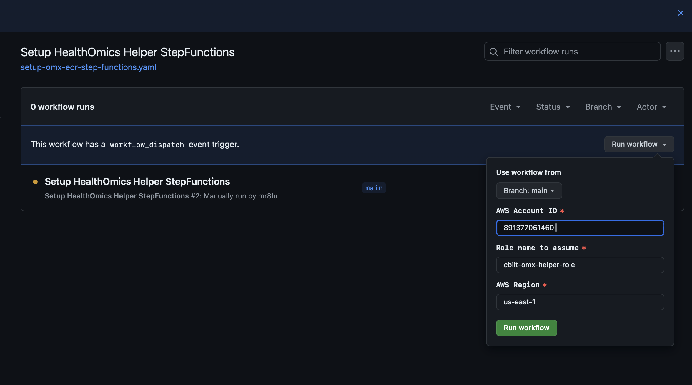
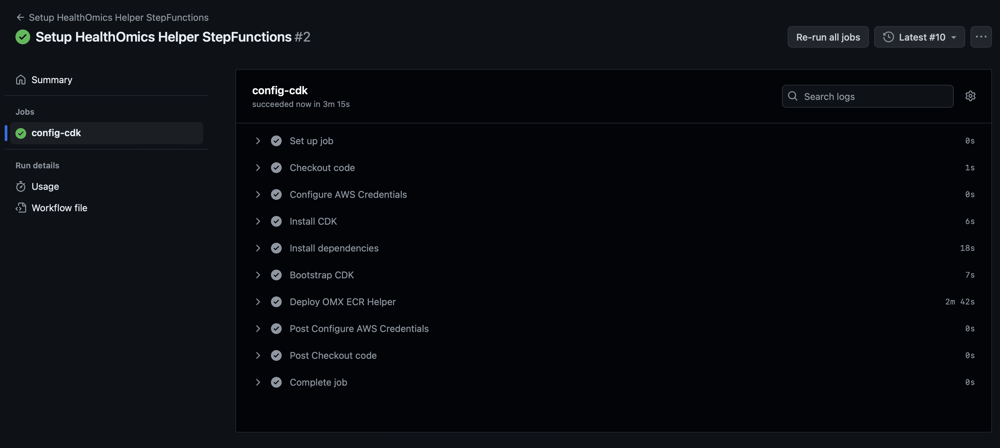

# Amazon ECR Helper for AWS HealthOmics

### Pre-requisite

To successfully run this github action, required the following items:

- IAM Role for HealthOmics
- S3 bucket for HealthOmics
- IAM Role for OMX helper

[This action](https://github.com/CBIIT/CloudOne_IaC/actions/workflows/adhoc-create-healthomics.yaml) can be used to provision the target account.

### Steps

In this repository, go to Github Action tab. Enter the AWS account ID and run the workflow.

The workflow will 

