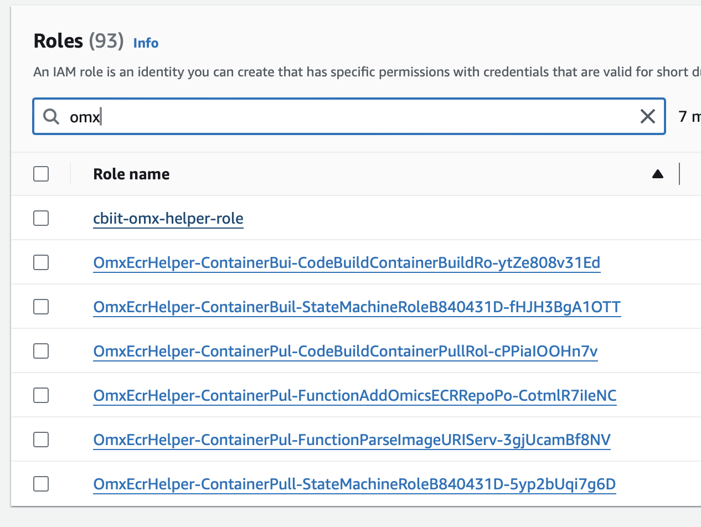

# CBIIT Managed HealthOmics ECR Helper

### Pre-requisite

To successfully run this github action, required the following items:

- IAM Role for HealthOmics
- S3 bucket for HealthOmics
- IAM Role for OMX helper

[This action](https://github.com/CBIIT/CloudOne_IaC/actions/workflows/adhoc-create-healthomics.yaml) can be used to provision the target account.

### Steps

In this repository, go to Github Action tab. Enter the AWS account ID and run the workflow.

This workflow will bootstrap the CDK in the `us-east-1` region, then it will deploy the ECR helper.

Once the workflow has completed, you can check in the AWS account to verify the resources has been created.

- S3 Buckets (`cdk-**` and `omx-bucket-cbiit-managed-***`)
- OMX helepr IAM Roles (`cbiit-omx-helper-role` and `OmxEcrHelper-***`)
- HealthOmics IAM Role (`CBIITHealthOmicsRole`)

